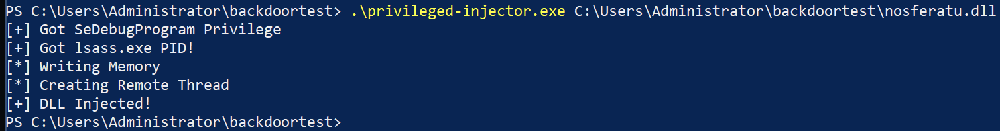
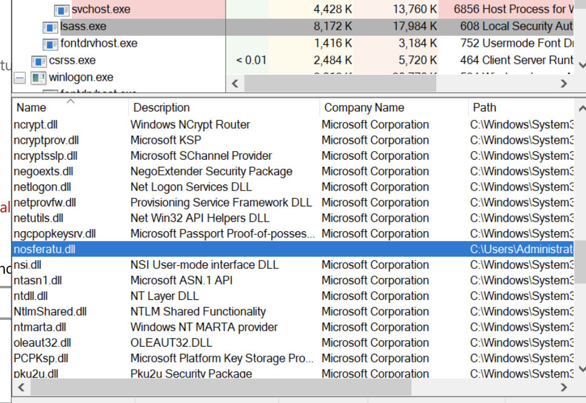
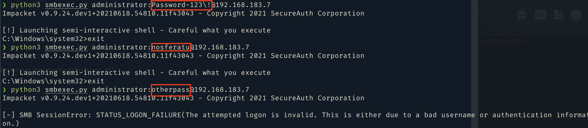

# nosferatu

Windows NTLM/Kerberos Authentication Backdoor 

## How it Works

First, the DLL is injected into the `lsass.exe` process, and will begin hooking authentication WinAPI calls. The targeted functions are:

- `NTLM: NtlmShared!MsvpPasswordValidate()`
- `Kerberos: cryptdll!CDLocateCSystem()`
- `Kerberos: samsrv!SamIRetrieveMultiplePrimaryCredentials()`

In the pursuit of not being detected, the hooked functions will call the original first and allow for the normal flow of authentication. Only after seeing that authentication has failed will the hook swap out the actual NTLM hash with the backdoor hash.

## Usage

nosferatu must be compiled as a 64 bit DLL. 

You can see it loaded using Procexp:

Login example using Impacket:

## Limitations
Hooks are not applied for 60 seconds while the system boots.
